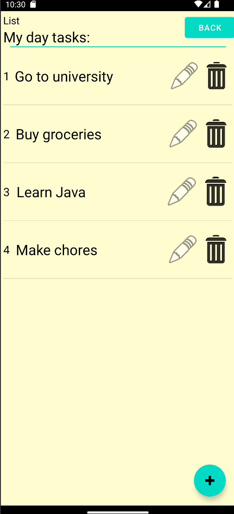

*IterTable*

My first android project, based on views layout and kotlin language.

This application helps you to manage different collections of data, suck as lists, queues, cycles etc.
You can use it to organize shopping list, wishlist, cleaning queue in your home.

Video demo of application:
[iterTable_demo.mp4](..%2F..%2FVideos%2FiterTable_demo.mp4)

It uses recycler view to display collection beautiful, user friend and maintainable.

*Installation*
To use it, you should:
 - Clone the repository;
 - Open project in android studio;
 - Build .apk file for release;
 - Run this file on your device.

Now you can use my application on your android device

